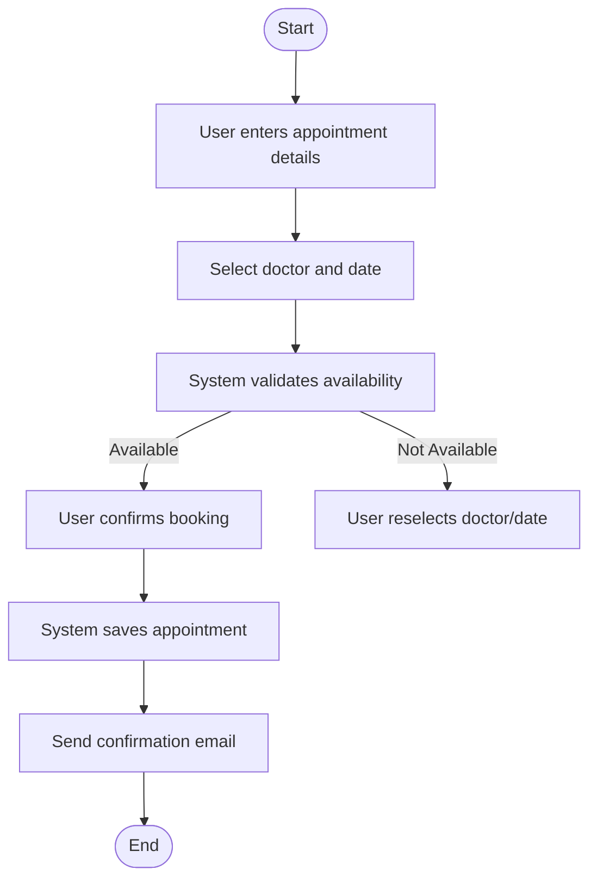
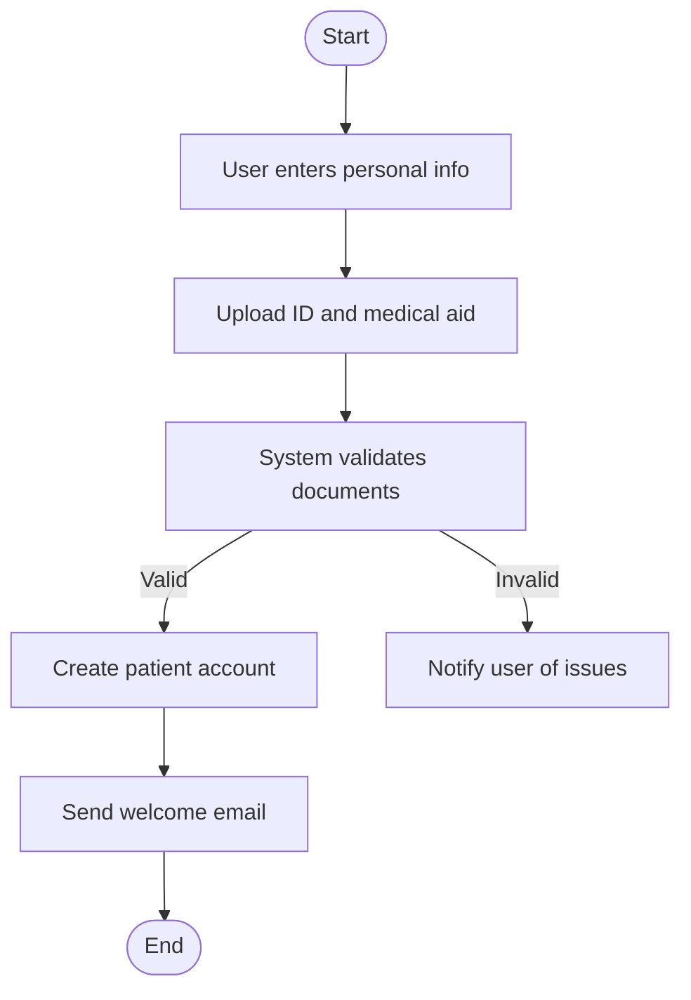
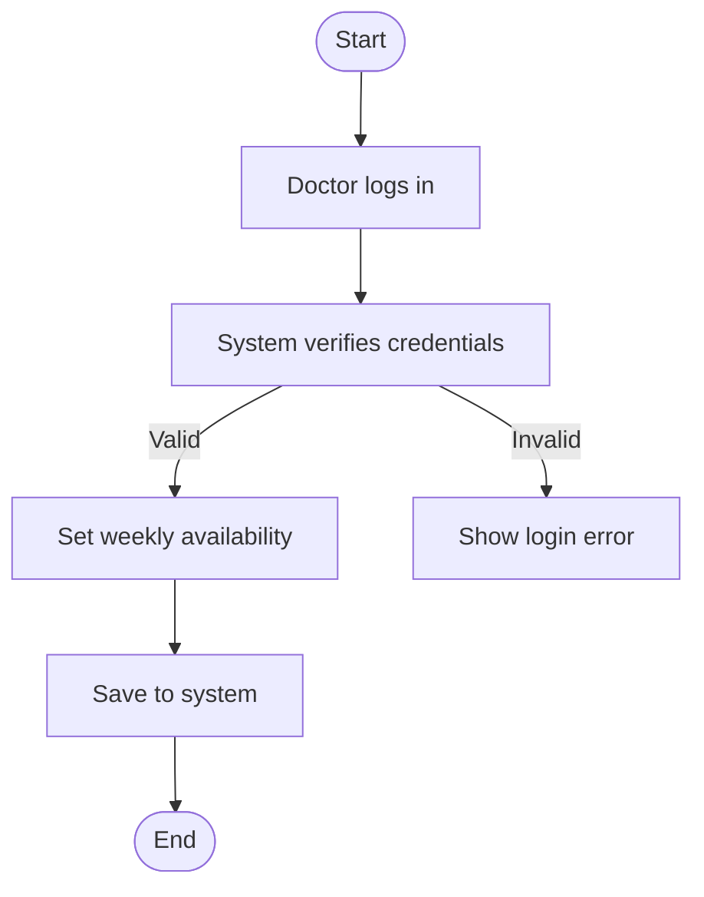
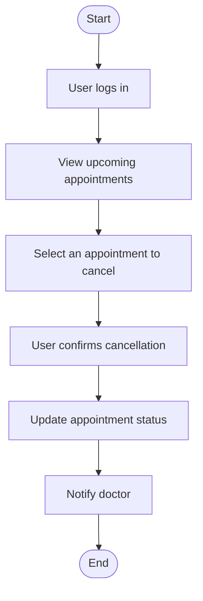
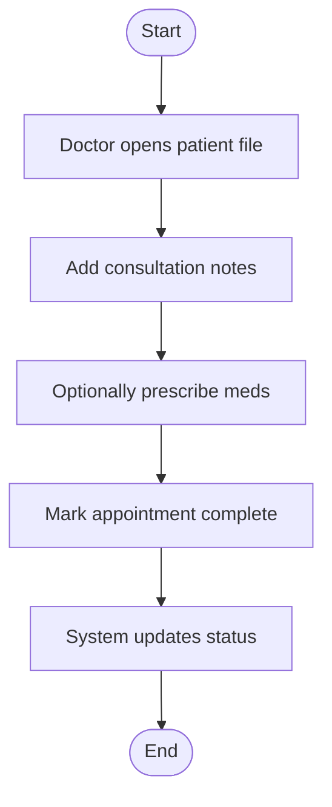
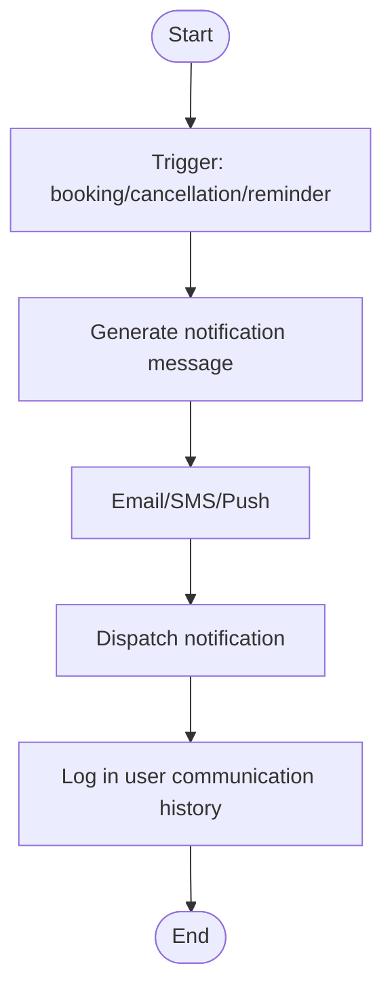
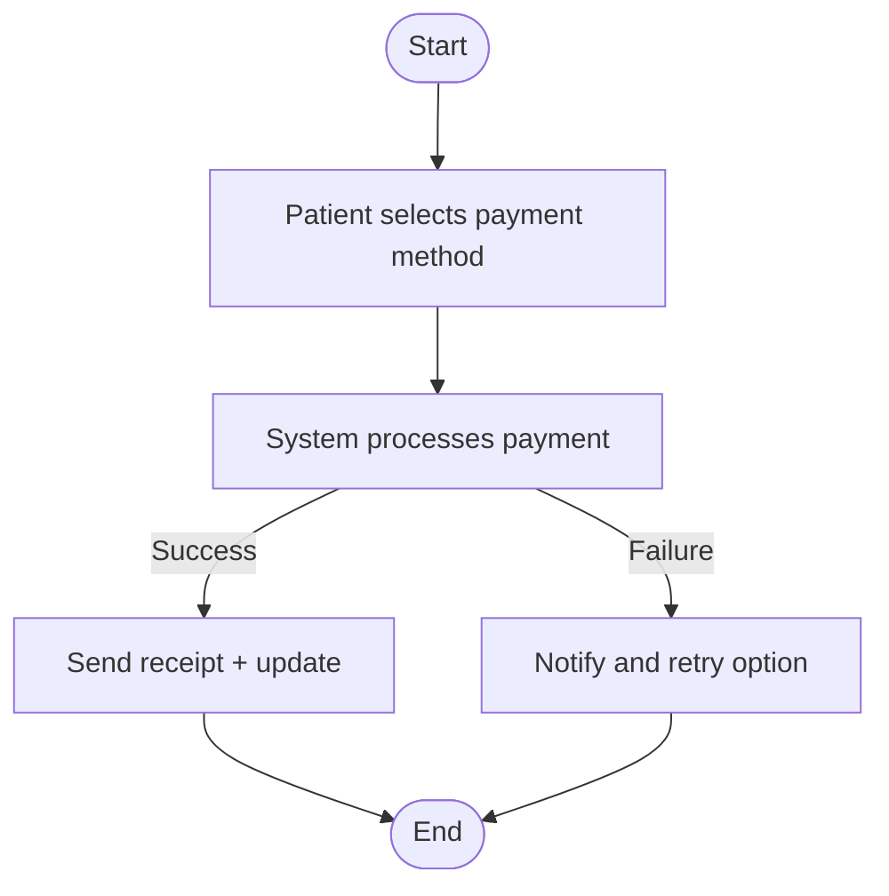

# Hospital Scheduler System – Activity Diagrams

This document contains activity diagrams for 8 key workflows in the Hospital Scheduler System. Each activity diagram follows UML standards using Mermaid and maps to relevant functional requirements from Assignment 4.

---

## 1. Book Appointment Workflow



**Explanation**:
- Aligns with FR-001: Allow users to book appointments.
- Ensures availability check and real-time confirmation to meet patient expectations.

---

## 2. Register New Patient Workflow



**Explanation**:
- Supports FR-002: New patient onboarding with proper verification.
- Branching ensures only valid users are registered.

---

## 3. Doctor Login and Availability Setup



**Explanation**:
- FR-004: Doctors should manage their availability.
- Login ensures only authorized users can modify slots.

---

## 4. Cancel Appointment Workflow



**Explanation**:
- FR-005: Enable users to cancel appointments.
- Keeps all parties notified and updates system data integrity.

---

## 5. Check-in Patient Workflow

```mermaid
flowchart TD
    Start([Start]) --> Arrive[Patient arrives]
    Arrive --> VerifyID[Reception verifies ID]
    VerifyID --> UpdateStatus[Update appointment to "Checked In"]
    UpdateStatus --> NotifyDoctor[Notify doctor]
    NotifyDoctor --> End([End])
```

**Explanation**:
- FR-006: Patients must check in before consultation.
- Keeps real-time appointment status updated for doctors.

---

## 6. Complete Consultation Workflow



**Explanation**:
- FR-007: Document consultations and prescribe.
- Ensures a clean wrap-up of the appointment lifecycle.

---

## 7. Generate and Send Notification



**Explanation**:
- FR-009: Automatic notifications.
- Parallel-ready for multiple channels, addresses scalability.

---

## 8. Process Payment Workflow



**Explanation**:
- FR-008: Payment system with success/failure handling.
- Improves UX by offering retry logic for failed payments.