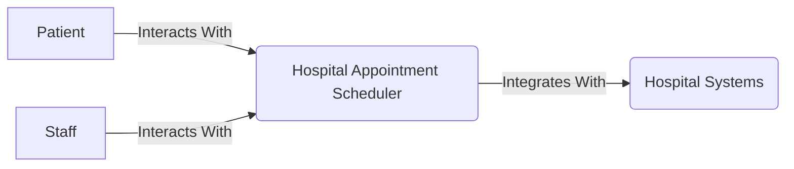
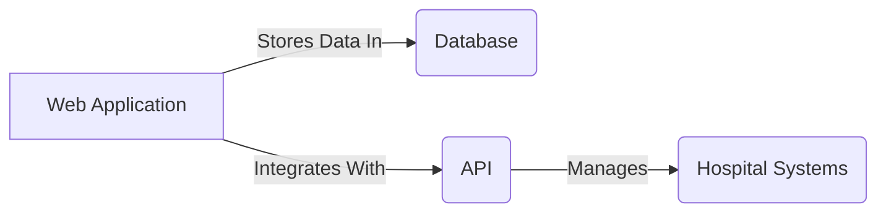
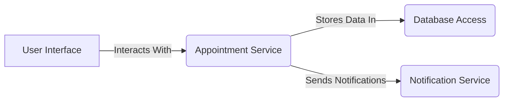

# Hospital Appointment Scheduler Architecture

## Project Title
Hospital Appointment Scheduler

## Domain
Healthcare - Hospital Appointment Management

## Problem Statement
The current manual appointment scheduling process in hospitals is time-consuming and often leads to misunderstandings or missed appointments. This system aims to automate and streamline the appointment scheduling process, improving patient satisfaction and reducing administrative burdens.

## Individual Scope
This project will focus on developing a user-friendly web application for patients and hospital staff to manage appointments efficiently. It will integrate with existing hospital systems to ensure real-time availability and reduce errors.

 ## Context Diagram

## Container Diagram

## Component Diagram

## Conclusion
The Hospital Appointment Scheduler system is designed to streamline appointment management for patients and staff, integrating with existing hospital systems for seamless data exchange.
