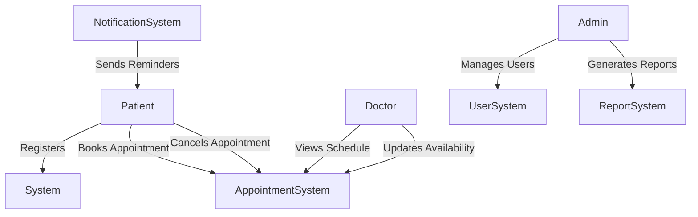

## 1. Use Case Diagram

```mermaid
graph TD;
  Patient -->|Registers| System;
  Patient -->|Books Appointment| AppointmentSystem;
  Patient -->|Cancels Appointment| AppointmentSystem;
  Doctor -->|Views Schedule| AppointmentSystem;
  Doctor -->|Updates Availability| AppointmentSystem;
  Admin -->|Manages Users| UserSystem;
  Admin -->|Generates Reports| ReportSystem;
  NotificationSystem -->|Sends Reminders| Patient;
```